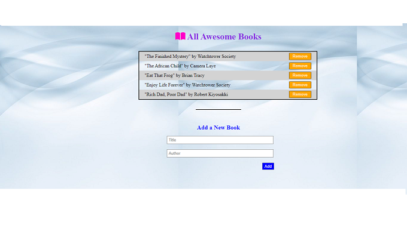

## Awesome books
Microverse project , Second project of Week 1 Module 2,
Working on a simple form, manipulating object data, object proporties and JavaScript classes using diferent methods and implementing it into front-end.

## Built With

- HTML
- CSS
- JavaScript
- Github actions

### Prerequisites

- WebBrowser
- Code editor: VSCode
- node js & npm

### Preview

https://Epaltechs.github.io/AwesomeBooks/

### Setup

git clone https://github.com/Epaltechs/Books.git

### Live Demo

[Coming soon](#)

### Setup

- nom Install

### Usage

-Open the project using a live server

## 👤Author
### Emmnanuel Paul
- GitHub: [https:/https://github.com/Epaltechs/Books]
- LinkedIn: [https://www.linkedin.com/in/emmanuel-paul-a2bab7b4/]
- Twitter: [http://twitter.com/@emmapaul247].

## 🤝 Contributor
👤 **Veljko Panic**

Contributions, issues, and feature requests are welcome!

Feel free to check the [issues page](https://github.com/Epaltechs/Books/issues).

## Show your support

Give a ⭐️ if you like this project!

## Acknowledgments

- Hat tip to anyone whose code was used
- Inspiration
- etc

## 📝 License

This project is [MIT](./MIT.md) licensed.
